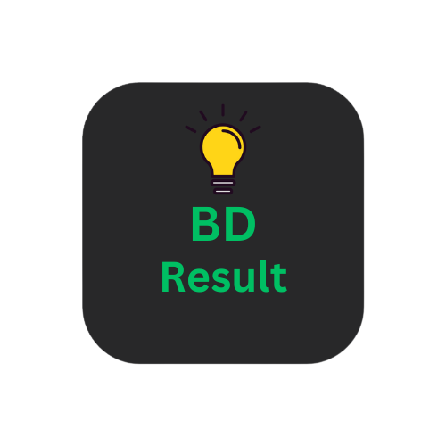
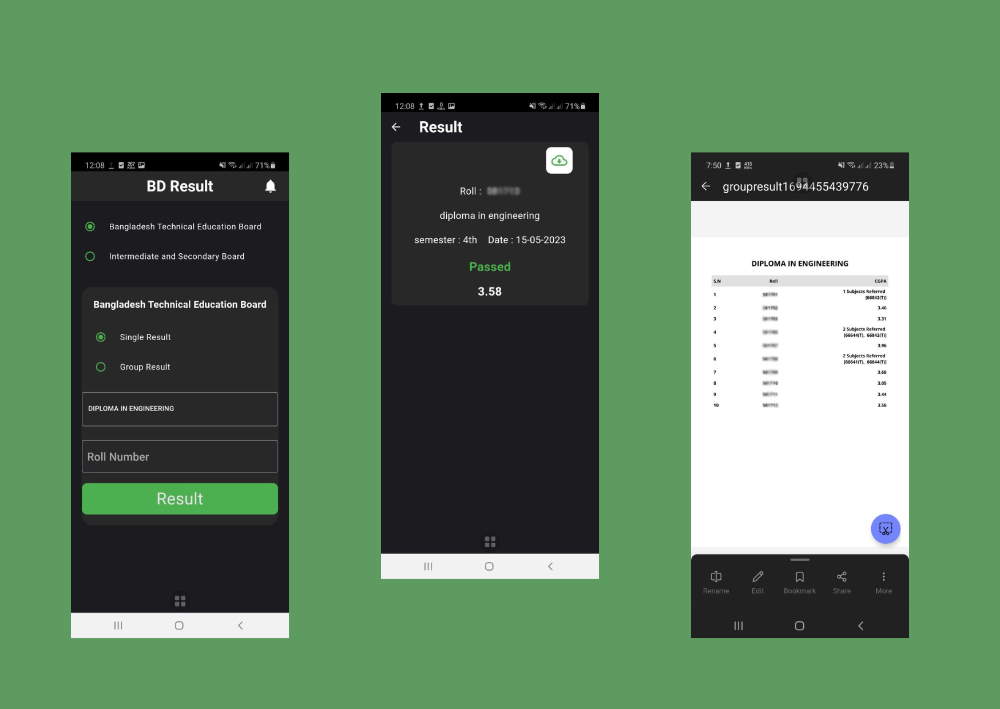
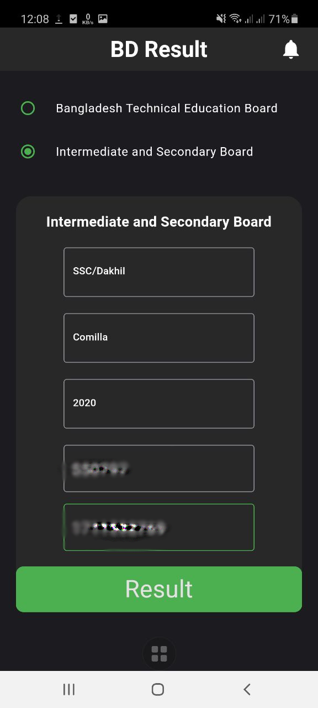
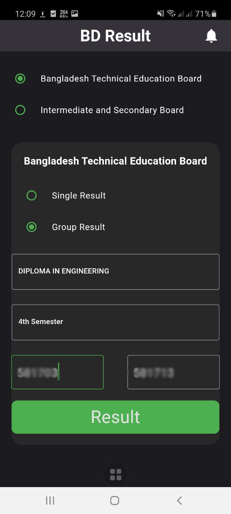
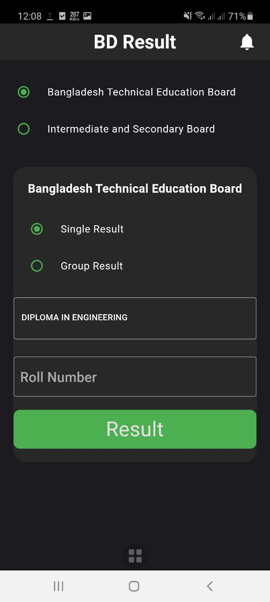
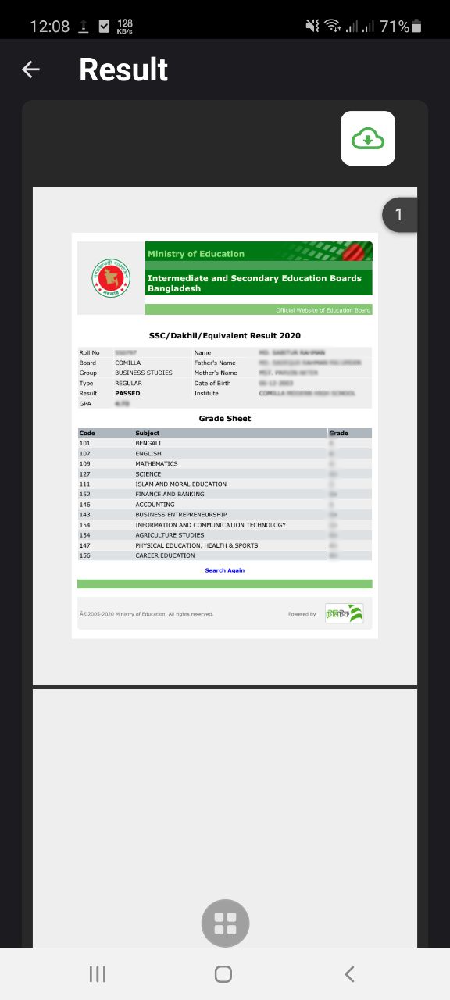
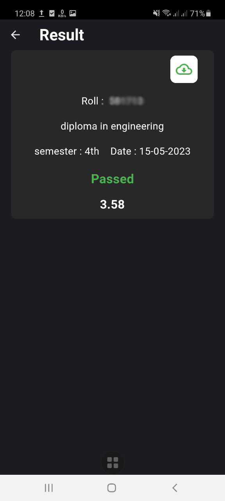
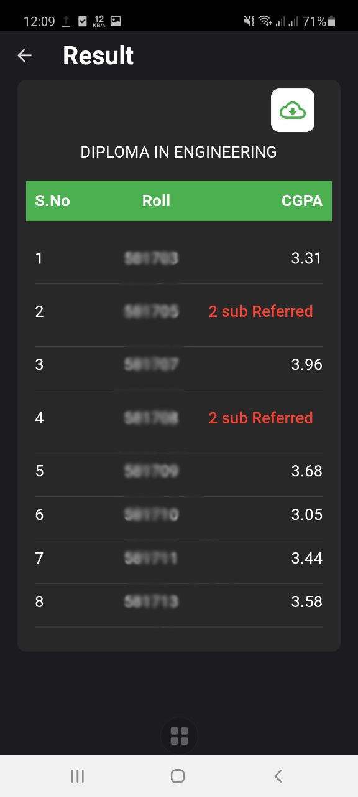
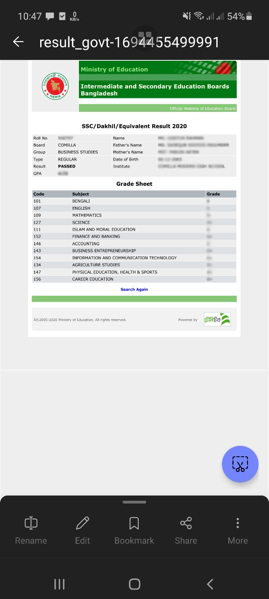
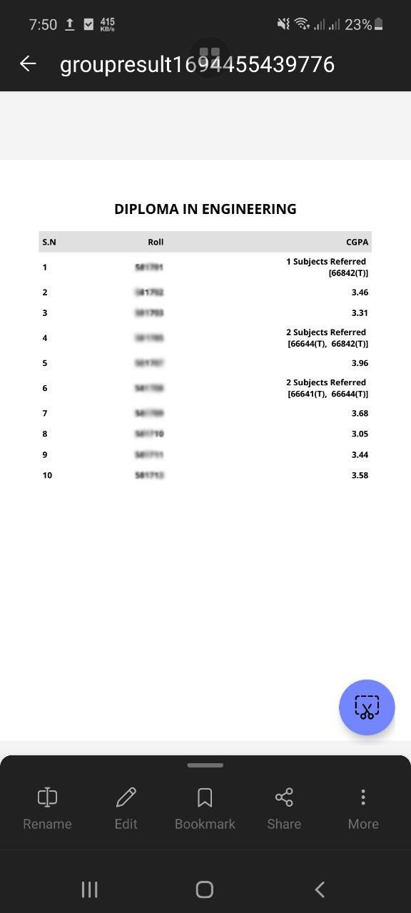

 

## **BD Result**
  

"BD Result" is an Android app designed to assist you in quickly accessing your Board Exam results and producing a printable PDF document
    

  
      

    <a href="https://github.com/RootHex200/BD_Result/issues">Report Bug</a>
    ·
    <a href="https://github.com/RootHex200/BD_Result/issues">Request Feature</a>
  

<!-- TABLE OF CONTENTS -->

  
Table of Contents

  <ol>
    <li>
      <a href="#about-the-project">About The Project</a>
      <ul>
        <li><a href="#features-with-snapshots">Features with Snapshots</a></li>
        <li><a href="#built-with">Built With</a></li>
      </ul>
    <li><a href="#roadmap">Roadmap</a></li>
   
  </ol>

## About The Project

 
"BD Result" is a mobile version of "educationboardresults.gov.bd" and "Bangladesh Technical Education Board result"
 
 
The "BD Result" app is a mobile application developed to provide users with swift and convenient access to Bangladesh's education board exam results. This app simplifies the process of checking exam results by allowing users to easily view and download their scorecards. Additionally, it offers the functionality to generate printable PDF files of the results for users' convenience. With the BD Result app, obtaining and sharing board exam results has become more accessible and efficient for students and their families.

(<a href="#top">back to top</a>)

## Features with Snapshots

1. Choose your exam board, year of examination, and the name of the exam. Also, enter your board roll registration semester using the classic user interface
   

snapshot

       
   

3. The results are neatly arranged with GPAs and the ability to create PDFs 
   

snapshot

     

   

4. After clicking the download button, the PDF will be saved in your download folder 
   

snapshot

    
   

## Built With 
#### Frontend Technology  
* [Flutter](https://flutter.dev/?gclsrc=ds&gclsrc=ds)  
Features and Plugins I've used: 
   - Dio
   - pdf
   - path_provider
   - Riverpod
   
   
* APK link: https://drive.google.com/file/d/1PPwtvpRI0SmI0c1w9Oyx5Uc9-wHULdLW/view?usp=drive_link

(<a href="#top">back to top</a>)

## Prerequisites
There are some prerequisites to run this app and server

######
* **Flutter**

  Flutter has a greate [documentation](https://docs.flutter.dev/get-started/install) for enviroment setup 
## Installation
1. Clone the repository to your local machine.
2. Open the project in your preferred IDE.
3. Run `flutter pub get` to install the required dependencies.

## Usage
- entrypoint in `src/`
- add your token in `CLIENT_ID` and `CLIENT_SECRET` varible in `/lib/src/constants/secret.dart` for html to pdf conversion [aspose](https://products.aspose.cloud/words/dart/conversion/html-to-pdf/)
- You can run the project on console using the command `flutter run`.

<!-- ## Roadmap
#### Frontend
data -->

(<a href="#top">back to top</a>)

